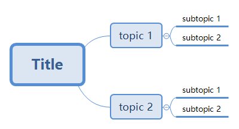

# xmindparser

parse xmind document in json/xml/yaml format

## Dependancy

```bash
pip3 install xmind
pip3 install dicttoxml
pip3 install pyyaml
```

## Examples



- print `test.xmind` in `json` format

```
# xmindparser test.xmind --pretty

{
  "name": "Title",
  "children": [
    {
      "name": "topic 1",
      "children": [
        {
          "name": "subtopic 1"
        },
        {
          "name": "subtopic 2"
        }
      ]
    },
    {
      "name": "topic 2",
      "children": [
        {
          "name": "subtopic 1"
        },
        {
          "name": "subtopic 2"
        }
      ]
    }
  ]
}
```

- pretty print `test.xmind` in `xml` format

```
# xmindparser -f xml test.xmind --pretty

<?xml version="1.0" ?>
<root>
  <name type="str">Title</name>
  <children type="list">
    <item type="dict">
      <name type="str">topic 1</name>
      <children type="list">
        <item type="dict">
          <name type="str">subtopic 1</name>
        </item>
        <item type="dict">
          <name type="str">subtopic 2</name>
        </item>
      </children>
    </item>
    <item type="dict">
      <name type="str">topic 2</name>
      <children type="list">
        <item type="dict">
          <name type="str">subtopic 1</name>
        </item>
        <item type="dict">
          <name type="str">subtopic 2</name>
        </item>
      </children>
    </item>
  </children>
</root>
```

- print `test.xmind` in `yaml` format

```
# xmindparser -f yaml test.xmind --pretty

name: Title
children:
- name: topic 1
  children:
  - name: subtopic 1
  - name: subtopic 2
- name: topic 2
  children:
  - name: subtopic 1
  - name: subtopic 2
```
